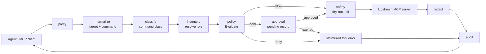
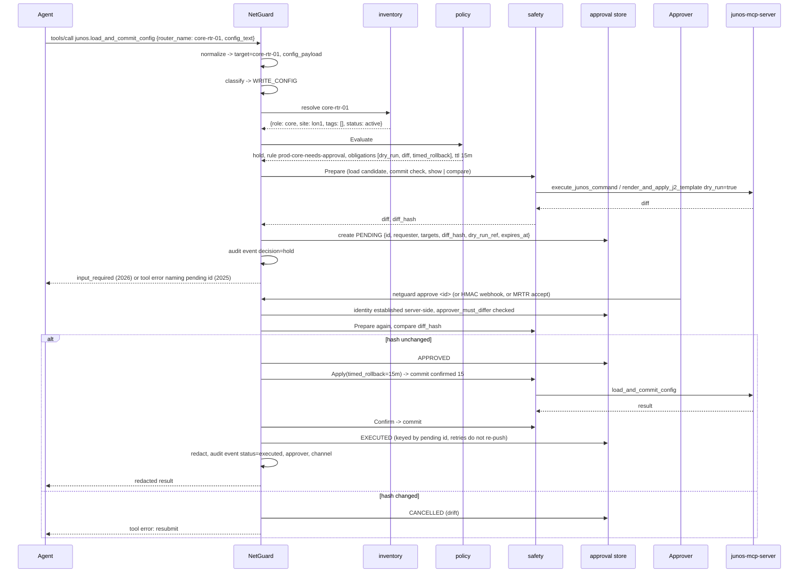

# Architecture

NetGuard is one process that is an MCP server toward the agent and an MCP client toward each upstream network-device MCP server. Every `tools/call` passes through a fixed pipeline: normalize, classify, resolve role, evaluate policy. The policy returns one of four decisions: allow, hold, deny, or (for a hold whose TTL ran out) expired. Every result passes back through the redactor and the audit writer.

This page is the system in one screen. The [ADRs](docs/adr/README.md) record why; the [specs](docs/specs/) say exactly how.

## Pipeline

A denied call returns a JSON-RPC tool result with `isError: true`, the rule id and the reason, so the agent can self-correct. A held call returns an MRTR `input_required` result (2026 era) or a tool error naming the pending id (2025 era). Nothing reaches the agent that has not passed through `redact` and `audit`.

## Components

Each stage is one Go package under `internal/`. The table is the contract between them.

| Package | Responsibility | Input | Output | Spec |
| --- | --- | --- | --- | --- |
| `internal/proxy` | Client-facing MCP server; upstream client manager; tool-name prefixing; dual-era transport handling; TOFU pinning of upstream tool descriptions | JSON-RPC from the agent; upstream `tools/list` | Forwarded calls; quarantine events | [ADR 0008](docs/adr/0008-dual-era-mcp-support.md) |
| `internal/normalize` | Canonicalise arguments using the per-server profile: `target`, `targets[]`, `commands[]`, `config_payload` | Raw `tools/call` arguments, profile | `Request` with canonical fields | [profile-schema](docs/specs/profile-schema.md) |
| `internal/classify` | Assign one class from the profile, or from the fallback classifier that inspects the payload; downgrade `EXEC_ARBITRARY` when every command passes the allow-list; meta-tool capability tables | `Request` | `Request.class` | [classification](docs/specs/classification.md) |
| `internal/inventory` | Resolve each target to `{role, site, tags, status}` through the resolver chain: static file, hostname patterns, upstream inventory, NetBox or Nautobot; mark stale snapshots | `targets[]` | `Device` per target, or `unknown` | [inventory-schema](docs/specs/inventory-schema.md) |
| `internal/policy` | Load the YAML policy; `Evaluate(policy, request) -> Decision`; session counters; optional OPA adapter later | `Request` with class and devices | `Decision{effect, rule_id, reason, obligations, approval}` | [policy-schema](docs/specs/policy-schema.md) |
| `internal/approval` | Pending store (SQLite) with TTL; CLI, HMAC webhook and MRTR channels; drift guard; idempotent execution keyed by pending id | `Decision` with effect hold | Approved, denied, expired or cancelled record | [approval-protocol](docs/specs/approval-protocol.md) |
| `internal/safety` | `ChangeSafety` drivers per platform: `Prepare`, `Apply`, `Confirm`, `Abort`; proxy watchdog for platforms without a native timer | Obligations `dry_run`, `diff`, `timed_rollback` | Diff, diff hash, rollback deadline | [change-safety-drivers](docs/specs/change-safety-drivers.md) |
| `internal/redact` | Ordered vendor regex list, then generic patterns; keyed truncated HMAC-SHA256 tokens; runs at the response serialiser | Every tool result | Redacted result, count and pattern ids | [redaction-patterns](docs/specs/redaction-patterns.md) |
| `internal/audit` | Hash-chained JSONL, Ed25519 checkpoints, `netguard audit verify`, OCSF and CEF exporters | One event per call | Appended line; checkpoint record | [audit-event-schema](docs/specs/audit-event-schema.md) |

Data that contributors edit without Go lives outside `internal/`: `profiles/` (one YAML per upstream server), `policies/examples/` (with `*.test.yaml` cases), and `tests/fixtures/configs/` (redaction corpus).

Toolchain note: `go.mod` declares Go 1.25.0 as the floor, builds with the Go named by its `toolchain` line ([ADR 0013](docs/adr/0013-pin-go-toolchain-in-go-mod.md)) and pins go-sdk v1.7.0, which `internal/proxy` imports. In M0 the proxy is pass-through: `tools/list` and `tools/call` are forwarded with the `<server>.` prefix and no pipeline stage runs yet ([profile-schema section 8](docs/specs/profile-schema.md#8-proxy-config-m0)).

## The two MCP eras

Most network MCP servers on GitHub still run 2025-era SDKs. The current spec, 2026-07-28, removed the handshake and sessions. NetGuard speaks both from M0.

| Concern | 2025-11-25 (stateful) | 2026-07-28 (stateless) |
| --- | --- | --- |
| Lifecycle | `initialize` / `notifications/initialized`; `Mcp-Session-Id` on HTTP | No handshake; every request carries version and client capabilities in `_meta`; optional `server/discover` |
| Tool list changes | `notifications/tools/list_changed` on the open stream | `subscriptions/listen` POST whose SSE response stays open |
| Human-in-the-loop | Server-initiated `elicitation/create` on the stream | MRTR: server returns `resultType: "input_required"` with `requestState`; client re-issues the call with `inputResponses` (`accept`, `decline`, `cancel`) |
| Routing headers | `MCP-Protocol-Version` | Plus `Mcp-Method` and `Mcp-Name`; header and body mismatch is rejected with `-32020` |
| How NetGuard holds a call | Tool error naming the pending id; agent polls `check_approval` | `input_required` whose `requestState` carries the signed pending id |

The proxy detects each peer's era per the spec's [backward-compatibility fallback](https://modelcontextprotocol.io/specification/2026-07-28/basic/transports/streamable-http#backward-compatibility) and translates between them. The go-sdk v1.7.0 negotiates the highest mutual version back to 2024-11-05. See [ADR 0008](docs/adr/0008-dual-era-mcp-support.md).

## A held call, end to end

The sequence below is the M3 exit criterion: a `WRITE_CONFIG` call on a `core` device is held, shows its diff, executes once on approval, expires on TTL, and refuses on drift.

If no approval arrives before `expires_at`, the record becomes EXPIRED. Expiry is terminal; a late `approve` is refused and audited.

## Trust boundaries

NetGuard assumes the following. Everything it enforces follows from them.

| Party | Trust | Consequence |
| --- | --- | --- |
| Agent (MCP client) | Untrusted | Arguments are canonicalised and classified by content, never by the tool name the agent chose or claims it made. Approver identity is never taken from the agent. Session counters are kept server-side. |
| Upstream tool descriptions and annotations | Untrusted | `readOnlyHint` and `destructiveHint` are one input, never sufficient. Descriptions are pinned on first use (TOFU); a change quarantines the server until reviewed. Upstream elicitation prompts are re-labelled with their origin. |
| Upstream tool output | Untrusted | Output is redacted before it reaches the agent. Output is never used to alter policy state. Raw output stays out of the audit log. |
| Approver | Authenticated server-side | CLI approvals use the local OS user; webhooks carry an HMAC over the body with a shared key; MRTR approvals are attributed to the client principal and satisfy `approver_must_differ` only when that principal differs from the requester. |
| Source of truth (NetBox, Nautobot) | Trusted data, unreliable availability | A stale snapshot is used when unreachable, and every decision made from it is marked `sot: stale` in the audit event. An outage never loosens policy silently. |
| Proxy host | Trusted | Keys for the redaction HMAC and the audit checkpoints live outside the log directory. Key custody beyond a file is an open question. |

Unknown targets are denied for `WRITE_CONFIG` and `EXEC_ARBITRARY` and allowed for reads, unless `defaults.unknown_target` says otherwise. A device absent from every resolver is not a device the agent may change.

## Out of scope

NetGuard is a network-semantic policy layer. It does not rebuild what generic MCP gateways already do well.

| Not built | Use instead |
| --- | --- |
| Authentication federation, OAuth flows, token exchange | [agentgateway](https://github.com/agentgateway/agentgateway), [IBM ContextForge](https://github.com/IBM/mcp-context-forge), or the MCP host's own auth |
| OpenTelemetry tracing and metrics pipelines | Put a generic gateway in front; NetGuard emits audit JSONL and OCSF or CEF |
| Multi-tenant catalogues, virtual servers, REST-to-MCP conversion | ContextForge, Kong, Traefik Hub |
| Generic PII detection | Lasso mcp-gateway plugins |
| A device connection library | The upstream server owns the SSH, eAPI, NETCONF or REST session; NetGuard only sees MCP |

See [ADR 0002](docs/adr/0002-standalone-proxy-not-gateway-plugin.md) for the positioning decision and the option of an ext-proc plugin for agentgateway later.

## Further reading

- [docs/PLAN.md](docs/PLAN.md), the approved plan
- [docs/PRD.md](docs/PRD.md), product requirements
- [ROADMAP.md](ROADMAP.md), the six milestones
- [docs/adr/README.md](docs/adr/README.md), all decision records
- [docs/specs/](docs/specs/), normative specs per component
- [docs/testing/test-strategy.md](docs/testing/test-strategy.md), the three tiers
- [docs/glossary.md](docs/glossary.md), vocabulary
- [SECURITY.md](SECURITY.md), reporting and threat model summary
