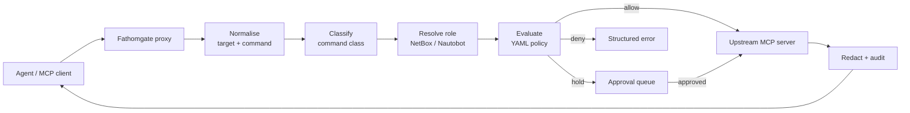
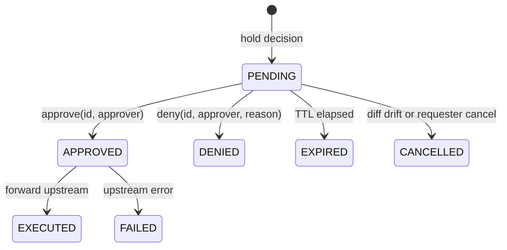

# Fathomgate MCP Proxy Plan

Sep 23, 2026 · Josh Scott

Build a Go, single-binary, policy-enforcing MCP proxy that sits between any AI agent and any network-device MCP server, with a Python companion for fixtures and policy tests. No vendor-agnostic, network-aware guardrail proxy exists as of September 2026.

## Decision summary

The project is a standalone MCP proxy (stdio and Streamable HTTP on both sides) that classifies every tool call by network semantics, resolves the target device's role from NetBox or Nautobot, evaluates a YAML policy, and either forwards, denies, or holds the call for human approval. Every result passes through a secret redactor and lands in a hash-chained audit log.

| Decision | Choice | Why |
| --- | --- | --- |
| Position | Network-semantic policy layer, not a generic gateway | Generic gateways (agentgateway, ContextForge, Kong, Traefik, Docker) already do auth, federation and tool-name ACLs; none knows what a device, config or commit is |
| Language | Go core, Python companion under `tests/` and `tools/` | Official go-sdk v1.7.0 is the most stable dual-era SDK; single static binary survives MCP-host launcher quirks; OPA embeds in-process later |
| Policy engine | Custom YAML DSL first, OPA/Rego as optional backend later | Decisions carry obligations (dry-run, diff, hold) that OPA/Cedar do not model natively; network engineers read YAML |
| Approval | Persisted pending record with TTL; approve via CLI, HMAC webhook, or in-band MRTR elicitation | Copies HCP Terraform's Needs Confirmation state and AWX approval-node timeouts |
| Audit | JSONL hash chain plus periodically signed checkpoints | CloudTrail digest pattern; OCSF and CEF as exporters, never the native format |
| First upstreams | netdev-ssh-mcp (read-only reference), then junos-mcp-server and ntunes/netmiko-mcp-server | Covers the read-only, write-with-guardrails, and write-with-no-safety cases |
| Name | Fathomgate, binary and module `fathomgate`; it replaced the placeholder NetGuard ([ADR 0019](adr/0019-rename-to-fathomgate.md), accepted 2026-09-24; T0.49) | No software product, package or registered mark uses it (searches of 2026-09-24), and it extends the Fathom design system. A professional trademark clearance search is still recommended before commercial or public use |

What makes it unclaimed: safety features for network MCP servers are being bolted into individual servers one PR at a time (Junos `block.cmd`, OPNsense read-only mode merged 2026-09-19, UniFi read-only mode). No project sits in front of all of them.

## Research findings

Four briefs were researched on 22–23 September 2026 (about 70 searches and page fetches). The full briefs are in the repo under `docs/research/`; this section is the part that shapes the design.

### MCP spec state

The current spec is [2026-07-28](https://modelcontextprotocol.io/specification/2026-07-28/changelog). It removed the `initialize` handshake and sessions, made every request self-describing via `_meta`, and requires `Mcp-Method` and `Mcp-Name` HTTP headers so intermediaries can route without parsing bodies. Human-in-the-loop is now Multi Round-Trip Requests (MRTR): a server returns `resultType: "input_required"` plus an opaque `requestState`, and the client re-issues the call with `inputResponses` (`accept`, `decline`, `cancel`). Most vendor network MCP servers still run 2025-era SDKs, so the proxy must speak both the stateful 2025-11-25 era and the stateless 2026 era from day one. Tool annotations (`readOnlyHint`, `destructiveHint`) are explicitly untrusted in the spec; the proxy classifies by inspecting the actual command or config payload instead.

### Generic gateways

| Gateway | Language | Tool allow/deny | Argument-level policy | Human approval | Network vocabulary |
| --- | --- | --- | --- | --- | --- |
| [agentgateway](https://github.com/agentgateway/agentgateway) (\~4.6k stars) | Rust | CEL RBAC | Possible via CEL | No | None |
| [IBM ContextForge](https://github.com/IBM/mcp-context-forge) (\~4.3k) | Python | RBAC + plugins | Via plugins | No | None |
| [Docker MCP Gateway](https://github.com/docker/mcp-gateway) (\~1.5k) | Go | Yes | No, admitted in [issue #574](https://github.com/docker/mcp-gateway/issues/574) | No | None |
| [Traefik Hub TBAC](https://doc.traefik.io/traefik-hub/mcp-gateway/guides/understanding-tbac) | Go | JWT-claim lists | Claimed | No | None |
| [Trail of Bits mcp-context-protector](https://github.com/trailofbits/mcp-context-protector) (\~225) | Python | No | No | Reviews description changes only | None |

Human approval is essentially absent from open-source gateways. Argument-aware policy is rare. Reuse, do not rebuild: tool-name prefixing for aggregated upstreams, Trail of Bits' TOFU description pinning for rug-pull defence.

### Network MCP servers (25 surveyed)

The important shape is the free-form "run a command" tool, present in almost every CLI-backed server. Target and command parameter names vary (`host`, `hostname`, `name`, `device`, `router_name`, `target`, `firewall`; `command` vs `commands[]`), so the proxy needs a normaliser. Only three servers enforce a positive allow-list on free-form commands ([netdev-ssh-mcp](https://github.com/krisiasty/netdev-ssh-mcp), [mcp-telecom](https://github.com/Avinash-Amudala/MCP-Telecom), [pyATS MCP](https://github.com/automateyournetwork/pyATS_MCP)); [junos-mcp-server](https://github.com/Juniper/junos-mcp-server) and [upa/mcp-netmiko-server](https://github.com/upa/mcp-netmiko-server) use blocklists; [ntunes/netmiko-mcp-server](https://github.com/ntunes/netmiko-mcp-server), [eos-mcp](https://github.com/shigechika/eos-mcp) and [scrapli-mcp](https://github.com/carlmontanari/scrapli-mcp) pass commands through unfiltered. Only netdev-ssh-mcp redacts secrets. Config-write semantics range from auto-commit-and-save (upa) to dry-run-by-default with a commit timer (eos-mcp). Cisco Meraki's official server uses a meta-tool (`execute_api(capability_id, …)`), so name-based policy alone cannot work there.

### Security corpus the proxy answers

[Invariant Labs tool poisoning and rug-pulls](https://invariantlabs.ai/blog/mcp-security-notification-tool-poisoning-attacks), [Trail of Bits line-jumping and ANSI deception](https://trailofbits.com/mcp/), the spec's [security best practices](https://modelcontextprotocol.io/specification/2025-06-18/basic/security_best_practices) (confused deputy in proxies, token passthrough), [OWASP MCP Top 10](https://owasp.org/www-project-mcp-top-10/) (MCP03 tool poisoning, MCP05 command injection, MCP08 missing audit), and [arXiv 2603.22489](https://arxiv.org/abs/2603.22489). MCP03 and MCP05 map directly onto CLI-executing network servers: a poisoned description or injected show output can steer an agent into `write erase`.

## Language decision

Go core with the official [go-sdk](https://github.com/modelcontextprotocol/go-sdk) (v1.7.0, 2026-07-28, co-maintained with Google), released as a single binary through GoReleaser; a Python package under `tests/` and `tools/` for FastMCP fixture servers, containerlab assertion helpers and `policy-lint`.

All four official SDKs are Tier 1 as of September 2026 and support client and server in one process. The two heaviest requirements decide it: a stable dual-era SDK that spawns upstreams (go-sdk has `CommandTransport` and MRTR `InputRequiredResult` on a year-old v1 line, while python-sdk v2 and typescript-sdk v2 are about eight weeks old with visible churn), and a one-step install that survives MCP-host launcher quirks (two Python peer projects document Claude Desktop stripping `PATH` and failing with ENOENT). Go is also the only language that embeds [OPA in-process](https://pkg.go.dev/github.com/open-policy-agent/opa/v1/rego), and the tools network engineers already install as binaries (containerlab, gnmic, Terraform, OPA) are Go.

| Criterion (weight) | Python | Go | Rust | TypeScript |
| --- | --- | --- | --- | --- |
| SDK maturity, client+server, dual-era (3) | 4 | 5 | 4 | 4 |
| Subprocess and concurrency (2) | 3 | 5 | 4 | 3 |
| One-step install (3) | 2 | 5 | 5 | 2 |
| Policy engine options (1) | 3 | 5 | 4 | 3 |
| Domain libs the proxy needs (1) | 5 | 4 | 3 | 3 |
| Testing across three tiers (2) | 5 | 4 | 3 | 4 |
| Network-engineer contributor pool (2) | 5 | 3 | 1 | 2 |
| MCP community pool (1) | 5 | 3 | 3 | 4 |
| Solo-author velocity (2) | 5 | 4 | 2 | 4 |
| Career signal (1) | 3 | 5 | 4 | 2 |
| Weighted total (max 90) | 70 | 79 | 60 | 57 |

What Python is better at (netmiko, napalm, pynetbox gravity; the widest contributor base) applies to the upstream servers and to test tooling, not the proxy core. The hybrid keeps that door open: a Python-only engineer can add a fixture server, a device assertion helper or a policy file without touching Go.

Risks: smaller Go contributor pool for core code (mitigated by keeping policies, redaction patterns and role mappings as data with a `fathomgate policy test` subcommand); go-sdk is younger than python-sdk (pin minor versions, run the official conformance suite in CI); `gopkg.in/yaml.v3` is unmaintained, so use `go.yaml.in/yaml/v3` or `goccy/go-yaml` from day one. Rust was rejected for solo-author velocity with no needed performance gain; "Python now, Go later" was rejected because security components rarely get rewritten.

## Architecture

The proxy is one process that is an MCP server toward the agent and an MCP client toward each upstream. Every `tools/call` passes through a fixed pipeline; every result passes back through the redactor and the audit writer.



A denied call returns a JSON-RPC tool error with the rule id and reason so the agent can self-correct; a held call returns an MRTR `input_required` (2026 era) or a tool error naming the pending id (2025 era).

### Tool classification

Each upstream tool is mapped to one class, from a per-server profile shipped with the proxy plus a fallback classifier that inspects the arguments. Tool annotations are one input, never trusted alone.

| Class | Meaning | Default policy |
| --- | --- | --- |
| `READ_OPERATIONAL` | Device state, ping, traceroute, typed show tools, free-form commands that pass the show/get/display allow-list | Allow, log, redact output |
| `READ_CONFIG` | Running, startup or candidate config, diffs, backups | Allow with mandatory redaction |
| `WRITE_CONFIG` | Any change to device or controller config, including commit, confirm, abort, rollback | Deny by default; hold for approval when policy allows; force dry-run first where the tool has one |
| `EXEC_ARBITRARY` | Unfiltered command execution, PFE shell, lab-node exec, XML op commands | Deny; downgrade to `READ_OPERATIONAL` only if every command passes the allow-list |
| `INVENTORY_READ` | Device, group and tag listings, source-of-truth reads | Allow; used to seed the target allow-list |
| `LAB_LIFECYCLE` / `LOCAL_ADMIN` | Deploy or destroy labs, trust host keys, start dashboards | Case by case; destroy is treated as a write |

The normaliser maps `host | hostname | name | device | router_name | target | firewall` to `target`, arrays, comma-separated strings, `@group` tokens and `tags` to `targets[]`, and `command | commands | config_commands | config_lines | config_text` to `commands[]` or `config_payload`. Unknown targets are denied: a device absent from the source of truth is not a device the agent may touch. Meta-tools such as Meraki's `execute_api` are classified on `capability_id` through a capability table.

### Device role sources

A source of truth is not a requirement. Role resolution is a lookup from target hostname to `{role, site, tags, status}`, and the proxy tries a chain of providers in order, first hit wins. NetBox and Nautobot are one provider in that chain, not a dependency.

| Order | Provider | Needs | Typical user |
| --- | --- | --- | --- |
| 1 | Static `inventory.yaml` (or `fathomgate inventory import devices.csv`) | Nothing | Most shops; MSP clients; anyone with a spreadsheet |
| 2 | Hostname patterns in the policy file (`^core-\|^border-` → role `core`; `^lab-` → tag `lab`) | A naming convention | Every network that has one |
| 3 | The upstream server's own inventory, read through its `INVENTORY_READ` tools at startup (ntunes `devices.yaml` tags, eos-mcp tags, junos `devices.json`) | The server already configured | Anyone already running one of those servers |
| 4 | NetBox or Nautobot REST, cached with a TTL; `fathomgate inventory sync` snapshots it into the static file | A source of truth | Shops that have one |

A target no provider resolves is `unknown`. The default policy for unknown targets is deny for `WRITE_CONFIG` and `EXEC_ARBITRARY` and allow for reads; `defaults.unknown_target` in the policy file flips it. When NetBox is configured but unreachable, the proxy uses the last snapshot and marks every decision made from it with `sot: stale` in the audit event, so an outage never silently loosens policy.

### Policy schema

One YAML file, evaluated by a pure function `Evaluate(policy, request) -> Decision`. A decision carries an effect, a reason and obligations, which is the vocabulary OPA and Cedar lack natively and the reason a small DSL comes first.

```yaml
version: 1
defaults:
  unknown_target: deny
  session:
    max_devices: 5
    max_pending: 2
rules:
  - id: reads-anywhere
    match: { class: [READ_OPERATIONAL, READ_CONFIG, INVENTORY_READ] }
    effect: allow
  - id: lab-writes-free
    match: { class: [WRITE_CONFIG], device_tags: [lab] }
    effect: allow
    obligations: [dry_run, diff]
  - id: prod-core-needs-approval
    match: { class: [WRITE_CONFIG], device_roles: [core, border] }
    effect: hold
    obligations: [dry_run, diff, timed_rollback]
    approval: { ttl: 15m, approver_must_differ: true }
  - id: fleet-cap
    match: { class: [WRITE_CONFIG] }
    when: { targets_count: { gt: 3 } }
    effect: deny
    reason: "fan-out above 3 devices needs a change ticket"
  - id: no-exec
    match: { class: [EXEC_ARBITRARY] }
    effect: deny
```

Rules evaluate in file order and the first match wins; there is no specificity ranking, so rule order is the author's precedence. Session caps and the unknown-target default apply before the rules, and an implicit `default:no-match` deny closes the list. Matchers stay limited to equality, set membership and numeric ranges; anything richer goes to the optional OPA backend later, which maps its result onto the same `Decision` type. Policies are tested with `fathomgate policy test`, which reads `*.test.yaml` files of `(request, expected decision)` so contributors never need a Go toolchain.

### Approval hold



The pending record (SQLite) is the source of truth: it stores the rendered change, the dry-run output and the diff hash. On approval the proxy re-runs the dry-run and refuses if the diff hash changed. Expiry is terminal. Approve or deny arrives through `fathomgate approve <id>`, a signed webhook (`POST /approvals/{id}` with HMAC, for Slack buttons or a ticketing system), or an in-band MRTR elicitation for the single-operator case. Approver identity is established server-side, never taken from the agent. Execution is keyed by pending id so a retried `tools/call` never pushes twice. Elicitation prompts from upstreams are re-labelled with their origin before reaching the client, closing the impersonation gap Docker's gateway documents.

### Change safety and rollback

A `ChangeSafety` driver per platform exposes `Prepare() -> diff`, `Apply(timedRollback)`, `Confirm()`, `Abort()`. Where the OS has no native timer, the proxy runs a watchdog that issues the vendor rollback if `Confirm()` is not called before the deadline.

| Platform | Dry-run / diff | Timed rollback | Confirm | Abort |
| --- | --- | --- | --- | --- |
| Junos | `show \| compare`, `commit check` | `commit confirmed <min>` | `commit` | `rollback 0` + `commit` |
| Arista EOS | `configure session` + `show session-config diffs` | `commit timer hh:mm:ss` | `commit` then `write` | `abort` |
| Cisco IOS-XE | `show archive config differences` | `configure terminal revert timer <min>` (needs `archive path`) | `configure confirm` | `configure revert now` |
| Cisco NX-OS | `checkpoint` + `show diff rollback-patch` | none (proxy watchdog) | n/a | `rollback running-config checkpoint <name> atomic` |
| PAN-OS | `validate full`, `show config diff` | none (proxy watchdog) | `commit` | `load config from` snapshot + `commit` |
| FortiOS | proxy-side diff of `show full-configuration` | none (proxy watchdog) | n/a | `execute restore config flash <id>` |

The first driver set is Junos and EOS (native timers), then IOS-XE, then NX-OS, PAN-OS and FortiOS (watchdog). gNMI commit-confirmed is the long-term vendor-neutral abstraction.

### Redaction

An ordered, in-process regex list runs at the response serialiser so no output bypasses it: vendor patterns first (Cisco types 0/4/5/7/8/9 including `$14$`, `snmp-server community`, `key-string`, `tacacs-server key`, `neighbor X password`; Junos `$1$`/`$5$`/`$6$`, reversible `$9$` and the `## SECRET-DATA` marker; EOS `sha512 $6$` and type 7; PAN-OS `phash` and `pre-shared-key`; FortiOS `ENC <base64>`), generic keyword and entropy patterns last. Matches are replaced with a keyed, truncated HMAC-SHA256 (`<redacted:hmac:3f9a…>`) so the same secret compares equal across devices inside one deployment without being brute-forceable, an improvement over netdev-ssh-mcp's unsalted SHA-256. Gitleaks runs in CI over sampled stored outputs as a canary. Upstream tool descriptions are pinned on first use (TOFU) and any change quarantines the server until reviewed.

### Audit log

JSONL, one event per line, canonicalised before hashing, with `seq`, `prev_hash` and `hash` per record and a signed Ed25519 checkpoint every N events or T minutes. `fathomgate audit verify` replays the chain. Each event carries who (principal, session, client), what (tool, class, argument hash), where (device ids, roles, tags, vendor), policy (version, rule ids, decision, obligations), approval (id, approver, channel), change safety (dry-run result, diff hash, rollback mechanism and deadline), outcome (status, duration, redaction count) and integrity fields. Raw device output stays out of the log and in a separate blob store keyed by hash. OCSF `API Activity` and CEF are exporters.

## Milestones

Six milestones, each shippable and each validated against at least one real upstream server before the next starts. Dates are effort estimates for evenings and weekends, not commitments.

| Milestone | Scope | Exit criteria | Validated against | Effort |
| --- | --- | --- | --- | --- |
| M0 Pass-through | Go proxy that spawns one stdio upstream, forwards `tools/list` and `tools/call`, prefixes tool names, speaks both protocol eras; GoReleaser binary | Official conformance suite passes on the client-facing side, every remaining failure baselined against an ADR or a board task; Claude Code and one other client list and call tools through it | netdev-ssh-mcp | 2 weeks |
| M1 Classify + allow/deny | Normaliser, per-server profiles, fallback classifier, static inventory and hostname-pattern roles, YAML policy loader, `Evaluate`, `fathomgate policy test`, structured deny errors | 100 percent of surveyed tools mapped; policy test suite green; `EXEC_ARBITRARY` downgrade works on show commands | netdev-ssh-mcp, upa/mcp-netmiko-server, eos-mcp `run_command` | 3 weeks |
| M2 Role-aware policy + redaction | optional NetBox and Nautobot resolver with cache, snapshot sync and stale marking; upstream-inventory provider; redactor with vendor grammar and keyed HMAC; TOFU description pinning | Redaction catches every pattern in the vendor fixture corpus; same policy resolves roles from a static file, from NetBox, and from a stale snapshot; changed tool description quarantines the server | netdev-ssh-mcp `get_config`, junos-mcp-server `get_junos_config`, netbox-mcp-server | 3 weeks |
| M3 Dry-run, diff, approval hold | `ChangeSafety` drivers for Junos and EOS; pending queue in SQLite with TTL; CLI approve/deny; HMAC webhook; MRTR elicitation for 2026-era clients; drift guard | A `WRITE_CONFIG` call is held, shows the diff, executes once on approval, expires on TTL, refuses on drift | junos-mcp-server `load_and_commit_config`, eos-mcp `push_config`, ntunes `send_config` | 4 weeks |
| M4 Audit chain + blast radius | Hash-chained JSONL, signed checkpoints, `fathomgate audit verify`, OCSF and CEF exporters; session counters, fan-out caps, canary-first rule, maintenance windows | Tampered log fails verify; fleet call above cap denied; canary rule enforces ordering | ntunes `send_config_parallel`, eos-mcp `run_command_batch`, junos `execute_junos_command_batch` | 3 weeks |
| M5 Console + watchdog drivers | Approval console and audit viewer (Fathom policy layer); IOS-XE, NX-OS, PAN-OS, FortiOS drivers with proxy-owned rollback watchdog; optional OPA backend | Watchdog rolls back an unconfirmed NX-OS change on a containerlab device; console shows pending, approved and denied calls live | Palo-MCP, mcfortigate, netdev-ssh-mcp on IOS-XE and NX-OS | 5 weeks |

After M1 the project is already useful and publishable: a read-only proxy that stops `reload` from reaching a device is a story on its own. Announce at M1, not M5.

## Test matrix

Three tiers. Tier 1 runs on every commit with no network. Tier 2 runs on every pull request against the real open-source MCP servers in containers. Tier 3 runs nightly on a self-hosted runner with containerlab, because cEOS images need an Arista account.

| Tier | What is real | How it runs | Speed |
| --- | --- | --- | --- |
| 1 Policy unit | Nothing; synthetic `tools/call` requests | `go test` table tests plus `fathomgate policy test` over `*.test.yaml`; go-sdk in-memory transport for the proxy's own MCP surface with a recording fake upstream | Seconds |
| 2 Real server, fake device | The upstream MCP server (its tool schemas, transport, error shapes) | testcontainers-go starts each server image over Streamable HTTP; a fake SSH server (Python asyncssh, in `tests/`) returns canned show output and echoes config lines | Minutes |
| 3 Real server, real device | Everything | containerlab topology with cEOS (and freely pullable Nokia SR Linux as a second target); Python assertion helpers over scrapli confirm device state | Nightly |

Every case names the real server it is validated against, so nothing in the plan is tested only against a mock.

| Case | Tier | Upstream server | Expected |
| --- | --- | --- | --- |
| `tools/list` passes through with server prefix | 2 | netdev-ssh-mcp | Tools appear as `netdev-ssh-mcp.run_show_command` etc. |
| Dual-era handshake | 2 | netdev-ssh-mcp (go-sdk, 2026 era), upa/mcp-netmiko-server (FastMCP, 2025 era) | Both upstreams initialise; conformance suite green |
| `show ip bgp summary` on lab device | 1, 2 | netdev-ssh-mcp | Allowed; classified `READ_OPERATIONAL` |
| `reload` via free-form command | 1, 2 | upa `send_command_and_get_output`, eos-mcp `run_command` | Denied by `no-exec`; error names rule id |
| `show running-config` through free-form tool | 2 | ntunes `send_command` | Reclassified `READ_CONFIG`; output redacted |
| Unknown host | 1, 2 | netdev-ssh-mcp (free-form `host`) | Denied; audit event shows `unknown_target` |
| Device tagged `lab`, config write | 2, 3 | eos-mcp `push_config` | Allowed with dry-run and diff obligations; commit timer set |
| Device role `core`, config write | 2, 3 | junos-mcp-server `load_and_commit_config` | Held; pending record created; diff shown |
| Approve via CLI within TTL | 2 | junos-mcp-server | Executed once; audit carries approver |
| Approve after TTL | 1, 2 | junos-mcp-server | Expired; approve refused |
| Diff drift between hold and approve | 2 | junos-mcp-server | Cancelled; agent told to resubmit |
| MRTR elicitation approval | 2 | junos-mcp-server, 2026-era client | `input_required` returned; retry with `accept` forwards |
| Fan-out above cap | 1, 2 | ntunes `send_config_parallel`, junos `execute_junos_command_batch` | Denied by `fleet-cap` |
| Canary-first ordering | 2 | ntunes `send_config_parallel` | Second device refused until canary confirmed |
| Secret redaction on `get_config` | 1, 2 | netdev-ssh-mcp, junos-mcp-server | Every fixture secret replaced with HMAC token; count logged |
| Tool description rug-pull | 2 | Any server with a modified description | Server quarantined; audit event |
| Upstream elicitation origin | 2 | junos-mcp-server (streamable-http) | Prompt re-labelled with server name |
| Meta-tool classification | 1 | Meraki official `execute_api` fixture | Class from `capability_id` table |
| Audit tamper | 1 | none | `audit verify` fails on edited line |
| Timed rollback fires | 3 | eos-mcp on cEOS | Unconfirmed session reverts at timer |
| Watchdog rollback | 3 | netdev-ssh-mcp on NX-OS image (when licensed) | Checkpoint restored at deadline |
| PATH-stripped launcher | 2 | Claude Desktop config with binary path | Proxy starts; no ENOENT |

The fixture corpus for redaction lives in `tests/fixtures/configs/` with one sanitised running-config per platform, each secret line annotated with the pattern id expected to catch it.

## Design system

Fathomgate uses Fathom (Midnight Zone dark by default, Chart Room light) plus a policy layer that names the states a guardrail has and a topology tool does not. No new hue, font or spacing step; every policy token aliases a Fathom semantic token. The layer lives in the repo as `design/tokens.css`, `design/policy.css`, `design/DESIGN.md` and `design/preview.html`; the console preview is published as the [Fathomgate Console](https://claude.ai/artifact/VpFRDQdCrxp1Bu4LWmMeFM) artifact.

| State | Word shown | Token | Fathom source |
| --- | --- | --- | --- |
| allow | Allowed | `--decision-allow` | `success` |
| hold | Holding (pulses while live) | `--decision-hold` | `warning` |
| deny | Denied, always with the rule id | `--decision-deny` | `danger` |
| expired | Expired | `--decision-expired` | `text-disabled` |
| redacted (not a decision) | `hmac:3f9a…` dashed token | `--redacted` | `accent` |

Components added, all prefixed `fg-`: decision badge, command-class chip (outline only, so it never competes with the badge), redacted token, diff view, approval card (the one glowing object per screen while pending), TTL bar (fills from the right; turns danger under two minutes), blast-radius meter (four discrete bands, never a gradient), audit timeline (newest first, dot per decision, truncated chain hash) and rule trace (the fired rule marked in `primary`).

Voice rules Fathomgate adds to Fathom's: every denial names its rule; verbs match the state machine everywhere (UI, CLI, audit log, docs) with no synonyms; a rule id is a technical value and is set in mono. The CLI prints decision, class, target, rule and reason in the same order the console shows them, and audit JSONL field names are the console's meta labels lowercased, so a screenshot and a log line describe one event in one vocabulary.

## Repo layout and first week

```
fathomgate/
  cmd/fathomgate/          main: serve, policy test, approve, deny, audit verify
  internal/proxy/          MCP server (client-facing) + upstream client manager, dual-era
  internal/normalize/      target and command canonicalisation, per-server profiles
  internal/classify/       command-class rules, allow-lists, meta-tool capability tables
  internal/policy/         YAML loader, Evaluate(), Decision, OPA adapter (later)
  internal/sot/            NetBox and Nautobot resolvers with cache
  internal/approval/       pending store (SQLite), TTL, CLI, webhook, MRTR
  internal/safety/         ChangeSafety drivers: junos, eos, iosxe, nxos, panos, fortios
  internal/redact/         ordered vendor patterns, keyed HMAC
  internal/audit/          hash chain, checkpoints, verify, OCSF and CEF exporters
  profiles/                one YAML per upstream server: tool -> class, param mapping
  policies/examples/       read-only.yaml, lab-open.yaml, prod-approval.yaml
  design/                  tokens.css, policy.css, DESIGN.md, preview.html
  console/                 M5 web console (static, consumes design/)
  tests/                   Python: FastMCP fixture servers, fake SSH, clab helpers, fixtures/configs/
  tools/policy-lint/       Python: same YAML schema, for contributors without Go
  docs/research/           the four research briefs from this plan
  .goreleaser.yaml, Dockerfile (distroless), .github/workflows/{ci,nightly-clab}.yaml
```

- [ ] Create the repo, MIT licence, `go mod init`, pin `github.com/modelcontextprotocol/go-sdk` v1.7.x and `go.yaml.in/yaml/v3`
- [ ] Copy `docs/research/` and `design/` from this plan
- [ ] M0: spawn netdev-ssh-mcp over stdio, forward `tools/list` and `tools/call` with the `netdev-ssh-mcp.` prefix
- [ ] Run the official conformance suite against the client-facing side; wire it into CI
- [ ] GoReleaser config producing linux, darwin and windows binaries on tag
- [ ] Write `profiles/netdev-ssh-mcp.yaml` by hand from the catalog in research brief 02
- [ ] Write `policies/examples/read-only.yaml` and its first three `*.test.yaml` cases
- [ ] README that opens with one sentence and one `mcp.json` snippet showing the proxy in front of a real server
- [ ] Decide the final name before the first public commit (see open questions)

## Open questions and risks

- [x] Name: NetGuard was a placeholder and collided with existing products; pick something searchable before the first public commit. Decided: Fathomgate, [ADR 0019](adr/0019-rename-to-fathomgate.md) (accepted 2026-09-24); the rename landed in board task T0.49
- [ ] Which MCP clients the first users run decides whether MRTR elicitation approval is in M3 or deferred; CLI and webhook approval ship regardless
- [ ] Whether the stale-snapshot window for an unreachable source of truth should be capped (deny everything after N hours) or left to the operator
- [ ] Key custody for audit checkpoints and the redaction HMAC: file, OS keyring or KMS
- [ ] Whether IOS-XR and Nokia SR Linux join the first driver set; both have native commit-confirmed and SR Linux images pull freely
- [ ] Whether to offer the policy layer as an ext-proc plugin for agentgateway once the standalone proxy is stable
- [ ] Release model and licence: open core, core under Apache-2.0 replacing the never-distributed MIT `LICENSE`, outside contributions by DCO sign-off. Proposed in [ADR 0020](adr/0020-open-core-apache-2.md) (status `proposed`, 2026-09-24), with the core/commercial boundary, the contested roadmap items and the extension seams

| Risk | Likelihood | Mitigation |
| --- | --- | --- |
| go-sdk breaking change in a minor release | Medium | Pin minor, run conformance suite on every dependency bump |
| Upstream servers change tool schemas without notice | High | Profiles are data; TOFU pinning quarantines a changed server; CI tier 2 catches drift weekly |
| YAML DSL grows into a bad Rego | Medium | Matcher limited to equality, set and range; OPA adapter is the escape hatch |
| cEOS licensing blocks public CI for tier 3 | High | Self-hosted nightly runner; SR Linux as the freely pullable second target |
| Regex redaction fails open on an unseen format | Medium | Vendor fixture corpus grows with every bug report; gitleaks canary in CI; optional allow-list mode for known-safe show commands |
| Solo maintainer burnout | Medium | Announce at M1; keep the contributor surface in YAML and Python |

## Sources

Full briefs with every citation are in `docs/research/01` through `04`. Pages opened during research:

- [MCP 2026-07-28 changelog](https://modelcontextprotocol.io/specification/2026-07-28/changelog) · [release post](https://blog.modelcontextprotocol.io/posts/2026-07-28/) · [elicitation](https://modelcontextprotocol.io/specification/2026-07-28/client/elicitation) · [tools](https://modelcontextprotocol.io/specification/2026-07-28/server/tools) · [Streamable HTTP](https://modelcontextprotocol.io/specification/2026-07-28/basic/transports/streamable-http) · [SDK tiers](https://modelcontextprotocol.io/community/sdk-tiers) · [security best practices](https://modelcontextprotocol.io/specification/2025-06-18/basic/security_best_practices)
- SDKs: [go-sdk](https://github.com/modelcontextprotocol/go-sdk) · [go-sdk v1.7.0](https://github.com/modelcontextprotocol/go-sdk/releases/tag/v1.7.0) · [python-sdk](https://github.com/modelcontextprotocol/python-sdk) · [typescript-sdk](https://github.com/modelcontextprotocol/typescript-sdk) · [rust-sdk](https://github.com/modelcontextprotocol/rust-sdk)
- Gateways: [agentgateway](https://github.com/agentgateway/agentgateway) · [IBM ContextForge](https://github.com/IBM/mcp-context-forge) · [Docker MCP Gateway](https://github.com/docker/mcp-gateway) and [issue #574](https://github.com/docker/mcp-gateway/issues/574) · [Lasso](https://github.com/lasso-security/mcp-gateway) · [sparfenyuk/mcp-proxy](https://github.com/sparfenyuk/mcp-proxy) · [Traefik TBAC](https://doc.traefik.io/traefik-hub/mcp-gateway/guides/understanding-tbac) · [Kong ai-mcp-proxy](https://developer.konghq.com/plugins/ai-mcp-proxy/) · [Trail of Bits mcp-context-protector](https://github.com/trailofbits/mcp-context-protector) · [awesome-mcp-gateways](https://github.com/keysersoft/awesome-mcp-gateways)
- Network MCP servers: [hecisaza curated list](https://github.com/hecisaza/network-mcp-servers) · [netdev-ssh-mcp](https://github.com/krisiasty/netdev-ssh-mcp) · [junos-mcp-server](https://github.com/Juniper/junos-mcp-server) · [ntunes/netmiko-mcp-server](https://github.com/ntunes/netmiko-mcp-server) · [upa/mcp-netmiko-server](https://github.com/upa/mcp-netmiko-server) · [eos-mcp](https://github.com/shigechika/eos-mcp) · [mcp-telecom](https://github.com/Avinash-Amudala/MCP-Telecom) · [scrapli-mcp](https://github.com/carlmontanari/scrapli-mcp) · [pyATS MCP](https://github.com/automateyournetwork/pyATS_MCP) · [Palo-MCP](https://github.com/apius-tech/Palo-MCP) · [mcfortigate](https://github.com/rsp2k/mcfortigate) · [Meraki official](https://github.com/CiscoDevNet/cisco-meraki-mcp-official) · [netbox-mcp-server](https://github.com/netboxlabs/netbox-mcp-server) · [OPNsense read-only PR](https://github.com/vespo92/OPNSenseMCP/pull/105)
- Security: [Invariant tool poisoning](https://invariantlabs.ai/blog/mcp-security-notification-tool-poisoning-attacks) · [Trail of Bits MCP series](https://trailofbits.com/mcp/) · [OWASP MCP Top 10](https://owasp.org/www-project-mcp-top-10/) · [arXiv 2603.22489](https://arxiv.org/abs/2603.22489) · [InfrastructureSentinel, AAAI-26](https://ojs.aaai.org/index.php/AAAI/article/view/41468/45429)
- Policy and approval: [OPA integration](https://www.openpolicyagent.org/docs/integration) · [OPA Go rego package](https://pkg.go.dev/github.com/open-policy-agent/opa/v1/rego) · [cedarpy](https://pypi.org/project/cedarpy) · [Claude Agent SDK hooks](https://code.claude.com/docs/en/agent-sdk/hooks) · [OpenAI Agents human-in-the-loop](https://openai.github.io/openai-agents-python/human_in_the_loop/) · [LangGraph interrupts](https://docs.langchain.com/oss/python/langgraph/interrupts) · [HCP Terraform run states](https://developer.hashicorp.com/terraform/cloud-docs/workspaces/run/states) · [AWX approval timeout issue](https://github.com/ansible/awx/issues/13465)
- Audit and redaction: [CloudTrail log validation](https://docs.aws.amazon.com/awscloudtrail/latest/userguide/cloudtrail-log-file-validation-intro.html) · [Sigstore Rekor](https://docs.sigstore.dev/logging/overview/) · [OCSF in Security Lake](https://docs.aws.amazon.com/security-lake/latest/userguide/open-cybersecurity-schema-framework.html) · [gitleaks](https://github.com/gitleaks/gitleaks) · [Cisco password types](https://community.cisco.com/t5/networking-knowledge-base/understanding-the-differences-between-the-cisco-password-secret/ta-p/3163238) · [Junos passwords](https://junipertrain.wordpress.com/2016/10/19/junos-passwords-in-configuration/)
- Rollback: [Junos vs EOS commit patterns](https://chewonice.com/2023/08/23/juniper-commit-confirmed-vs-arista-configure-session/) · [IOS-XE revert timer](https://iosxrjunos.wordpress.com/2025/05/16/how-cisco-ios-ios-xe-implements-juniper-like-commit-and-rollback-behavior/) · [NX-OS rollback](https://www.cisco.com/c/en/us/td/docs/dcn/nx-os/nexus3548/102x/configuration/system-management/cisco-nexus-3548-switch-nx-os-system-management-configuration-guide-102x/m-configuring-rollback.html) · [PAN-OS commit](https://docs.paloaltonetworks.com/ngfw/pan-os-cli-quick-start/use-the-cli/commit-configuration-changes) · [FortiOS revisions](https://community.fortinet.com/fortigate-3/technical-tip-using-the-revision-option-to-revert-to-a-previous-configuration-96374) · [gNMI commit-confirmed](https://github.com/openconfig/reference/blob/master/rpc/gnmi/gnmi-commit-confirmed.md) · [Batfish change validation](https://batfish.readthedocs.io/en/latest/notebooks/linked/introduction-to-forwarding-change-validation.html)
- Language and distribution: [scrapligo](https://github.com/scrapli/scrapligo) · [go-netbox](https://github.com/netbox-community/go-netbox/releases) · [GoReleaser](https://goreleaser.com/blog/homebrew-gofish/) · [yaml.v3 migration](https://github.com/go-task/task/issues/2171) · [ContextForge SDK v2 migration](https://github.com/IBM/mcp-context-forge/issues/6218) · [agentgateway design post](https://agentgateway.dev/blog/2026-06-04-designing-agentgateway-unified-gateway/) · [containerlab](https://github.com/srl-labs/containerlab)
- Design: [Fathom design system](https://claude.ai/artifact/EAmcPjFiSHKMwpBX9oj8Gf) · [Fathomgate Console preview](https://claude.ai/artifact/VpFRDQdCrxp1Bu4LWmMeFM)
