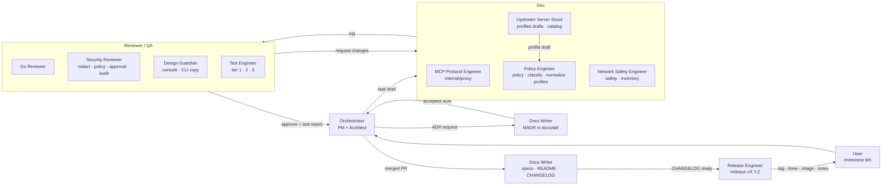

# Fathomgate agent team

Eleven Claude Code agents build Fathomgate, one per ownership boundary, run through a fixed pipeline: PM → Architect → [Dev ↔ Reviewer/QA] → Docs → Release. The agent files live in `.claude/agents/` in the [agency-agents](https://github.com/msitarzewski/agency-agents) format; the slash commands in `.claude/commands/` start the common workflows.

Every agent speaks the vocabulary from `docs/PLAN.md` exactly: decisions `allow`, `hold`, `deny` and the terminal hold state `expired`; classes `READ_OPERATIONAL`, `READ_CONFIG`, `WRITE_CONFIG`, `EXEC_ARBITRARY`, `INVENTORY_READ`, `LAB_LIFECYCLE`, `LOCAL_ADMIN`; obligations `dry_run`, `diff`, `timed_rollback`; driver methods `Prepare`, `Apply`, `Confirm`, `Abort`. An agent that uses a synonym is corrected by the Design Guardian.

## Roster

| Agent | File | Owns | Receives from | Hands to |
| --- | --- | --- | --- | --- |
| Orchestrator | `orchestrator.md` | `ROADMAP.md`, `CHANGELOG.md` at merge, `docs/milestones/`, the pipeline and the ADR gate | User (`/milestone`), reviewers' verdicts, Test Engineer's reports | Task briefs to Dev agents; ADR requests to Docs Writer; PRs to reviewers; `/release` to Release Engineer |
| MCP Protocol Engineer | `mcp-protocol-engineer.md` | `internal/proxy`, `cmd/fathomgate serve`, conformance in CI | Orchestrator (brief, ADR); Policy Engineer (`Decision` type); Network Safety Engineer (`ChangeSafety`) | PR to Go Reviewer and Security Reviewer; tier-2 scenarios to Test Engineer; spec deltas to Docs Writer; CLI flags to Release Engineer |
| Policy Engineer | `policy-engineer.md` | `internal/policy`, `internal/classify`, `internal/normalize`, `profiles/`, `policies/`, `tools/policy-lint/`, `fathomgate policy test|eval|lint` | Orchestrator; Upstream Server Scout (profile drafts); Network Safety Engineer (obligation capability matrix) | `Decision` shape to MCP Protocol Engineer; PR to Go Reviewer and Security Reviewer; `*.test.yaml` to Test Engineer; schema deltas to Docs Writer |
| Network Safety Engineer | `network-safety-engineer.md` | `internal/safety` (vendor drivers, watchdog), `internal/inventory` (`Resolver` interface and chain, snapshots, stale marking, CSV import; live NetBox and Nautobot connectors are paid-edition work, ADR 0034 amendment) | Orchestrator; Scout (native dry-run/timer hooks); Policy Engineer (obligation semantics) | Driver interface to MCP Protocol Engineer; capability matrix to Policy Engineer; PR to Go Reviewer and Security Reviewer; transcripts and tier-3 cases to Test Engineer |
| Security Reviewer | `security-reviewer.md` | `docs/security/threat-model.md`, `SECURITY.md`, review gate on `redact/`, `policy/`, `classify/`, `approval/`, `audit/`, elicitation and quarantine | Orchestrator (`/security-review`); Dev agents' PRs; Scout's hazard notes | Findings to the PR author; verdict and ADR requests to Orchestrator; attack inputs to Test Engineer; threat-model text to Docs Writer |
| Go Reviewer | `go-reviewer.md` | Review gate on every Go PR: idiom, errors, context, goroutines, tests, godoc, lint, dependencies, static binary | Orchestrator; every Dev agent's Go PR | Review to the PR author; verdict to Orchestrator; flags missing Security or Test reviews |
| Test Engineer | `test-engineer.md` | `tests/` (fixture servers, fake asyncssh device, tier-2 testcontainers, tier-3 containerlab), `docs/testing/test-matrix.md` status column, CI test jobs | Orchestrator; Policy Engineer (`*.test.yaml`); MCP Protocol Engineer (scenarios); Network Safety Engineer (transcripts); Security Reviewer (attack inputs); Scout (matrix rows) | Test report to Orchestrator; discrepancy reports to Dev agents; green tier-2 link to Release Engineer |
| Design Guardian | `design-guardian.md` | `design/DESIGN.md`, `design/tokens.css`, `design/policy.css`, `design/preview.html`; review gate on `console/`, CLI and error copy | Orchestrator; Dev agents' user-facing strings; Docs Writer's screenshots | Review to the PR author; `DESIGN.md` deltas to Docs Writer; exact strings to Test Engineer |
| Docs Writer | `docs-writer.md` | `docs/adr/` (MADR), `docs/specs/`, `README.md`, `CHANGELOG.md` text, `docs/glossary.md` | Orchestrator (`/adr`, merged PRs); every agent's spec or doc deltas | Scaffolded ADRs to owning engineer; accepted ADR number to Orchestrator; CHANGELOG section and README to Release Engineer |
| Release Engineer | `release-engineer.md` | `.goreleaser.yaml`, `Dockerfile`, Homebrew tap, release workflow, `docs/install.md`, `mcp.json` snippets, semver, tag ritual | Orchestrator (`/release`); Test Engineer (green run); Security Reviewer (Security entries); Docs Writer (README, naming ADR) | Install commands and release URL to Docs Writer; tag pushed or blocking reason to Orchestrator |
| Upstream Server Scout | `upstream-server-scout.md` | `docs/research/02-network-mcp-servers.md`, `docs/upstreams/`, draft `profiles/<server>.yaml`, proposed matrix rows | Orchestrator or user (`/profile`); Test Engineer (discrepancies) | Profile drafts to Policy Engineer; matrix rows to Test Engineer; hazards to Security Reviewer; native safety hooks to Network Safety Engineer |

## Slash commands

| Command | Adopts | What it does |
| --- | --- | --- |
| `/milestone M1` | Orchestrator | Reads `ROADMAP.md` and `docs/PLAN.md`, checks the tree is green, decomposes the milestone into tasks with owner, reviewers, matrix rows and ADR flag, writes `docs/milestones/M1.md`, dispatches the first brief |
| `/adr <title>` | Docs Writer | Scaffolds `docs/adr/NNNN-slug.md` from the MADR template, names the interface affected, adds the index row |
| `/profile <github-url>` | Upstream Server Scout | Reads the server's source at a pinned commit, drafts `profiles/<server>.yaml`, writes `docs/upstreams/<server>.md` with hazards, proposes matrix rows |
| `/policy-check <policy.yaml>` | Policy Engineer | Runs `make policy-lint` and `make policy-test`, explains each failure with the rule trace, warns on missing obligations or tests |
| `/security-review` | Security Reviewer | Works the attack catalogue against the branch diff, cites OWASP MCP Top 10, updates the threat model, returns a verdict |
| `/release vX.Y.Z` | Release Engineer | Runs the release checklist: preflight, snapshot build, container, snippets, CHANGELOG cut, signed tag, post-release verification |

## Pipeline



Reviewer routing is fixed: Go Reviewer on every Go PR; Security Reviewer on anything under `internal/redact`, `internal/policy`, `internal/classify`, `internal/approval`, `internal/audit`, or on elicitation and quarantine changes in `internal/proxy`; Design Guardian on `console/`, `design/`, CLI output and agent-facing error text; Test Engineer on every PR that claims a test-matrix row. The Dev ↔ Reviewer loop repeats until every required reviewer approves; the Orchestrator never breaks a tie by merging.

## Installing the roster

Project-local (already in place when you clone the repo): Claude Code reads `.claude/agents/*.md` and `.claude/commands/*.md` from the repo root. Nothing to do.

User-global, so the agents are available in every project:

```sh
cp .claude/agents/*.md ~/.claude/agents/
cp .claude/commands/*.md ~/.claude/commands/
```

With the agency-agents tooling, point its install script at this repo's `.claude/agents/` directory (the files carry the same frontmatter: `name`, `description`, `color`, `emoji`, `vibe`, `tools`), for example:

```sh
git clone https://github.com/msitarzewski/agency-agents ~/src/agency-agents
~/src/agency-agents/scripts/install.sh --source /path/to/fathomgate/.claude/agents
```

Invoke an agent by name in Claude Code ("use the Policy Engineer to …"), or run a slash command, which adopts the right agent for you.

## How a milestone runs end to end

Using M1 (Classify + allow/deny) as the example:

1. **Kick-off.** You run `/milestone M1`. The Orchestrator reads `ROADMAP.md` and the M1 row in `docs/PLAN.md`, confirms `go test ./... && golangci-lint run && make policy-test` are green, and writes `docs/milestones/M1.md`: tasks for the normaliser (`internal/normalize`), per-server profiles (`profiles/`), fallback classifier and downgrade rule (`internal/classify`), static inventory and hostname-pattern resolvers (`internal/inventory`), the YAML loader and `Evaluate` (`internal/policy`), `fathomgate policy test`, structured `deny` errors (`internal/proxy`), and the `*.test.yaml` suites. Each task names its owner, reviewers, matrix rows (`show ip bgp summary` on lab device; `reload` via free-form command; `show running-config` through free-form tool; Unknown host; Meta-tool classification) and docs.
2. **Decisions first.** Tasks that define `policy.Decision`, the class set, the profile schema and the policy schema are flagged ADR = yes. The Orchestrator runs `/adr` for each; the Docs Writer scaffolds; the Policy Engineer fills the Decision Outcome; Go Reviewer and Security Reviewer sign the Consequences; the Orchestrator flips Status to `accepted`. No code PR opens against a `proposed` ADR.
3. **Profiles from source.** `/profile https://github.com/krisiasty/netdev-ssh-mcp`, then upa/mcp-netmiko-server and eos-mcp: the Scout drafts `profiles/*.yaml` with `confidence` tags and hazards; the Policy Engineer verifies each row against source before signing.
4. **Dev ↔ Review loop.** The Policy Engineer writes the `*.test.yaml` cases, the mirrored Go table tests, then the code; runs `go test ./... -race`, `make policy-test`, `make policy-lint`, and the `fathomgate policy eval` checks (`show ip bgp summary` → `allow READ_OPERATIONAL`; `reload` → `deny EXEC_ARBITRARY … no-exec`). The PR goes to Go Reviewer and Security Reviewer (downgrade rule and blocklist are security-relevant) and to the Test Engineer for a tier-2 run against the real netdev-ssh-mcp, upa and eos-mcp images over the fake asyncssh device. Findings loop back until every reviewer approves. The Design Guardian reviews the `deny` error text: "Denied by `no-exec`: free-form `reload` on core-rtr-01", in the order decision, class, target, rule, reason.
5. **Docs in the same PR.** The Docs Writer updates `docs/specs/policy-schema.md`, `docs/specs/classification.md`, `docs/glossary.md` and the README quickstart inside each code PR; the Orchestrator adds the `CHANGELOG.md` `[Unreleased]` line at merge.
6. **Validation and close.** The Test Engineer's report moves the M1 rows in `docs/testing/test-matrix.md` to `validated` with the real image tags. The Orchestrator checks every M1 exit criterion (100 percent of surveyed tools mapped; policy test suite green; `EXEC_ARBITRARY` downgrade works on show commands), marks M1 closed in `ROADMAP.md`, and runs `/release v0.2.0`.
7. **Release and announce.** The Release Engineer runs preflight, snapshot, container, snippet and launcher checks, cuts `CHANGELOG.md`, pushes the signed tag, verifies brew and the image, and hands the URL to the Docs Writer, who publishes the M1 announce post: a read-only proxy that stops `reload` from reaching a device.

Then `/milestone M2`.

## State between agents

Every handoff in the pipeline above crosses through files, not chat: the board `docs/milestones/<Mn>.yaml`, the rendered `STATUS.md`, and one note per handoff in `docs/handoffs/`. `/status` reads them; `/handoff` writes them. The protocol is in [docs/handoffs/README.md](../handoffs/README.md).
