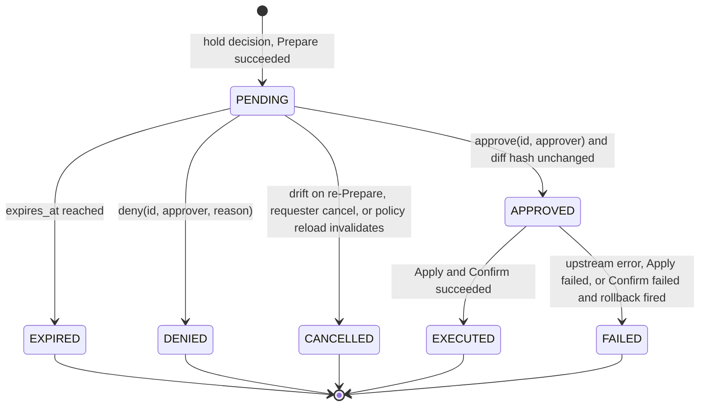

# Approval protocol

Normative specification for holding a call, storing the pending record, and moving it through the state machine. A hold decision creates a PENDING record with a TTL in SQLite. Approval arrives through the CLI, an HMAC-signed webhook, or an in-band MRTR elicitation. Approver identity is established server-side. Expiry is terminal. Execution is keyed by pending id, so a retry never pushes twice.

Decision record: [ADR 0004](../adr/0004-approval-hold-state-machine.md). Owning package: `internal/approval`. Companion: [change-safety-drivers.md](change-safety-drivers.md), [audit-event-schema.md](audit-event-schema.md).

## 1. State machine



Words shown to humans: Holding (PENDING), Approved, Denied, Expired, Cancelled, Executed, Failed. No synonyms.

Transitions not in the diagram are refused with `error_class: invalid_transition` and audited. In particular, `approve` on EXPIRED is refused, and `approve` on APPROVED or EXECUTED returns the existing state without side effects.

## 2. Pending record

Table `pending` in `approval.db` (SQLite, WAL mode).

| Column | Type | Meaning |
| --- | --- | --- |
| `id` | text, primary key | ULID. Shown to humans as the first 8 characters plus enough to be unique, but every API takes the full id. |
| `state` | text | One of the seven states |
| `created_at`, `updated_at`, `expires_at` | text | RFC 3339 UTC. `expires_at = created_at + ttl`; the TTL comes from the matched rule's `approval.ttl`, default `15m`. |
| `requester` | text | The authenticated principal of the MCP client that made the call. Never taken from tool arguments. |
| `session_id` | text | The proxy session the call arrived on. |
| `server`, `tool`, `class` | text | As classified; `class` is always `WRITE_CONFIG` or `EXEC_ARBITRARY` (reads are never held). |
| `targets` | text (JSON array) | Canonical target names after normalisation. |
| `args_sha256` | text | SHA-256 of the canonical unredacted arguments. |
| `rule_id`, `reason`, `obligations` | text | Copied from the `Decision`. |
| `approver_must_differ` | integer (0/1) | From the rule's `approval`. |
| `prepare_ref` | text | Blob-store key of the redacted dry-run output produced by `ChangeSafety.Prepare`. |
| `diff_sha256` | text | SHA-256 of the normalised diff from `Prepare`. The drift guard compares against this. |
| `decided_by`, `decided_at`, `decision_channel`, `decision_comment` | text | Filled on approve or deny. `decision_channel` is `cli`, `webhook` or `mrtr`. |
| `execution_id` | text | Set when Apply starts; equals `id`. Guarantees idempotent execution. |
| `error_class`, `error_detail` | text | Filled on FAILED or CANCELLED. `error_detail` is redacted before storage. |

Indexes: `(state, expires_at)` for the expiry sweep; `(requester, state)` for per-session `max_pending` counting.

## 3. Creating a hold

1. `Evaluate` returns `effect: hold`. The proxy runs every obligation that can run before approval: `dry_run` and `diff` through the target's `ChangeSafety.Prepare`. If `Prepare` fails, the call is denied with `error_class: prepare_failed` and no record is created.
2. The proxy inserts the PENDING row with `diff_sha256` and `prepare_ref`, and writes an audit `call` record with `decision: hold` and `approval.id`.
3. The proxy answers the agent (section 6) and returns. Nothing is sent upstream.

## 4. TTL and expiry

- The TTL is mandatory. Rules without `approval.ttl` inherit `15m`. Operators may cap it globally with `approval.max_ttl` in the proxy config (planned, M3).
- A sweeper runs every 30 seconds and moves every PENDING row with `expires_at <= now` to EXPIRED. Expiry is terminal: `approve` and `deny` on an EXPIRED record are refused with `invalid_transition`.
- The console shows the remaining time in the TTL bar; under two minutes the bar turns to the danger colour (see `design/DESIGN.md`). The CLI prints `expires in 11m42s`.
- When the requester's session ends before a decision, the record stays PENDING until it expires. An approval after session end still executes; the audit record notes `requester_session: closed`.

## 5. Drift guard

On `approve`, before any transition, the proxy re-runs `Prepare` against the live device and recomputes `diff_sha256`.

- Equal: transition to APPROVED and continue.
- Different: transition to CANCELLED with `error_class: drift`, store the new hash in `error_detail`, audit it, and tell the approver "The device changed since this was held; the agent must resubmit." Never apply a diff the approver has not seen.
- `Prepare` fails: CANCELLED with `error_class: prepare_failed`.

Approving therefore always costs one extra dry-run round trip to the device. That is deliberate.

## 6. Decision channels

All three channels call the same internal `Decide(id, verdict, approver, comment)`; the channel only establishes the approver's identity.

### 6.1 CLI

```
fathomgate approve <id> [--comment "..."]
fathomgate deny    <id> --reason "..."
fathomgate pending [--json]
```

`fathomgate pending` lists every PENDING record and, for each, shows the diff, the rule trace and the rule that held it, with the fields in the CLI order of `design/DESIGN.md` (decision, class, target, rule, reason), the pending id and the time left. `--json` carries the same fields. No one has to approve without them ([PRD R35](../PRD.md#6-requirements), [ADR 0025](../adr/0025-split-the-console.md)).

The CLI talks to the running proxy over a Unix domain socket (`$XDG_RUNTIME_DIR/fathomgate.sock`, mode 0600) or a named pipe on Windows. The approver is the OS user that owns the socket connection, resolved via `SO_PEERCRED` (Linux) or `getpeereid` (macOS). The socket is never exposed over TCP.

### 6.2 Webhook

`POST /approvals/{id}` on the proxy's HTTP listener, intended for Slack interactive buttons, ticketing systems or a CI gate.

Request:

```
POST /approvals/01J8Q4V7X2 HTTP/1.1
Content-Type: application/json
X-Fathomgate-Timestamp: 1758600738
X-Fathomgate-Signature: v1=3f9a17c2e0b4...

{"verdict":"approve","approver":"slack:U024BE7LH","comment":"Change ticket CHG0041882"}
```

- `X-Fathomgate-Signature` is `v1=` plus hex HMAC-SHA256 over `timestamp + "." + raw body`, keyed with the shared secret configured per webhook source. Requests older than 300 seconds or with a bad signature are rejected with 401 and audited as `approval_rejected`.
- `approver` is the identity asserted by the signing system. The proxy records it as `webhook:<source>:<approver>` so it can never be confused with a CLI identity.
- Response `200 {"id":"…","state":"APPROVED","executed":false}`; execution happens asynchronously and is reported in the audit log. `409` for `invalid_transition`, `404` for an unknown id, `410` for EXPIRED.

### 6.3 In-band MRTR elicitation (2026-07-28 clients)

When the client advertised `elicitation.form` in `_meta.io.modelcontextprotocol/clientCapabilities`, the hold response is an `input_required` result:

```json
{
  "resultType": "input_required",
  "requestState": "<signed: pending id + expires_at>",
  "inputRequests": {
    "approval": {
      "message": "Fathomgate is holding junos.load_and_commit_config on core-rtr-01 (rule prod-core-needs-approval). Diff sha256:4c1e…b90a, 3 lines. Approve?",
      "requestedSchema": {
        "type": "object",
        "properties": {
          "approve": {"type": "boolean"},
          "comment": {"type": "string"}
        },
        "required": ["approve"]
      }
    }
  }
}
```

- The message always names the proxy as the asker, the server, tool, target, rule id and diff hash, so an upstream server can never impersonate the prompt.
- On retry with `inputResponses.approval.action = accept` and `approve: true`, the proxy calls `Decide` with the approver set to the session principal and channel `mrtr`. `decline` or `approve: false` denies. `cancel` leaves the record PENDING until it expires.
- If `approver_must_differ` is set, an in-band approval from the requester's own session is refused with `invalid_transition` and the message tells the agent to ask a second person to run `fathomgate approve`.
- `requestState` is an HMAC-signed blob of `{id, expires_at}`; a tampered or expired state is rejected.

### 6.4 Legacy clients (2025-11-25) and clients without elicitation

The hold returns a tool error (`isError: true`) whose text is:

```
Holding: junos.load_and_commit_config on core-rtr-01 needs approval (rule prod-core-needs-approval, pending 01J8Q4V7X2, expires in 15m). A human runs `fathomgate approve 01J8Q4V7X2`; then call `fathomgate.check_approval` with the id.
```

The proxy exposes a `fathomgate.check_approval(id)` tool returning `{state, expires_at, executed, result?}`. When the state is EXECUTED the original tool result is returned once, then the record is marked delivered.

## 7. Execution and idempotency

- `Decide(approve)` transitions to APPROVED and enqueues execution keyed by `id`. A second approval, a retried MRTR call, or a duplicate webhook finds the row already APPROVED or later and returns the current state without side effects.
- Execution runs the remaining obligations: `Apply(timed_rollback=true)` when `timed_rollback` is present, otherwise `Apply(false)`; then `Confirm()` after the post-check passes. Confirm failure or post-check failure triggers `Abort()` and the state becomes FAILED with `error_class: rollback_fired`.
- The original agent session may be gone. Execution does not depend on it.

## 8. Separation of duties

- `approver_must_differ: true` compares the approver identity string with `requester`. Identities are namespaced by channel (`cli:josh`, `webhook:slack:U024BE7LH`, `mrtr:<session principal>`), so the comparison is on the canonical principal behind the namespace when the proxy can resolve it, otherwise on the full string. An unresolved comparison is treated as "same" (fail closed).
- The CLI and the local console show "Approver must differ from requester" on such records.
- An approval from the local console (M5) is no stronger than one from the CLI and never satisfies `approver_must_differ` on its own, because the agent may run as the same OS user ([ADR 0025](../adr/0025-split-the-console.md)). Its identity namespace is set by the local console ADR ([ADR 0024](../adr/0024-local-console-embedded-loopback-only.md), accepted).

## 9. Audit hooks

Every transition writes an audit record (planned type `approval`, M3; until then the `call` record's `approval` object and `status` carry the outcome): hold → `decision: hold, status: pending`; approve → `status: approved`, `approval.approver`, `approval.channel`; deny → `status: denied`; expiry → `status: expired`; drift → `status: cancelled, error_class: drift`; execution → `status: executed | failed`.

## 10. Failure modes and what the operator sees

| Situation | State | Word shown | error_class |
| --- | --- | --- | --- |
| Dry-run fails before hold | none (denied) | Denied | `prepare_failed` |
| Nobody decides in time | EXPIRED | Expired | — |
| Device changed before approval | CANCELLED | Cancelled | `drift` |
| Requester approves own hold with `approver_must_differ` | PENDING (unchanged) | Holding | `invalid_transition` |
| Bad webhook signature | PENDING (unchanged) | Holding | `approval_rejected` |
| Confirm fails, rollback fires | FAILED | Failed | `rollback_fired` |
| Upstream error during Apply | FAILED | Failed | `upstream_error` |

## 11. Tests

Tier 1: state-machine table tests over every transition including the refused ones; drift guard with a fake `ChangeSafety`; TTL sweep with a fake clock. Tier 2: junos-mcp-server `load_and_commit_config` held, approved via CLI, executed once (test-matrix cases 8–12); MRTR round trip with a 2026-era client; webhook signature accept and reject. Tier 3: eos-mcp `push_config` on cEOS with `timed_rollback`, unconfirmed session reverts.
